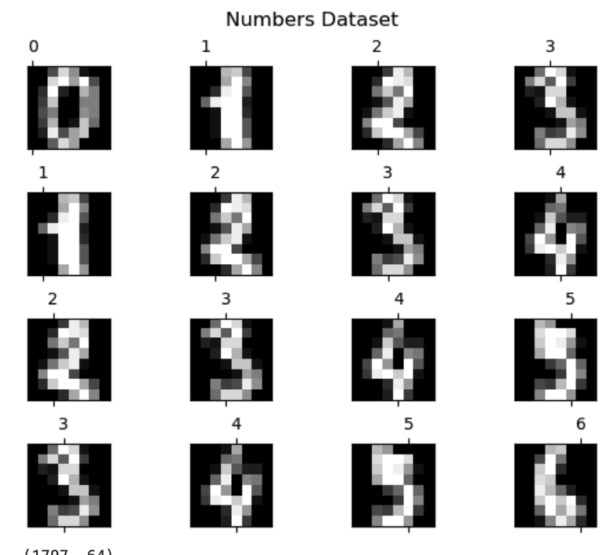

# Scikitlearn Digits Classification

## Summary
You can feed this model a drawing of a number from 0-9, and it'll be able to sucessfully determine what number you gave it.

## Creation
I created this model by importing the digits dataset from Scikitlearn. Then I took the data and split it. After that, I used a loop to loop through the first 16 numbers in the dataset, and had MatPlotLib graph them all in subplots. I created the neural network, and had GridSearchCV find me the how many neurons work the best with this model and dataset. Finally, I fitted the neural network with the dataset, and analyzed its accuracy.

## Results

The results were a success, with about a 95% accuracy score. 

Numbers Dataset Graphed:

